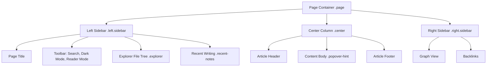

# Quartz v5 Architecture & Context

This document outlines the architecture, layout structure, styling, and key components of this Quartz v5 digital garden wiki. It serves as an context-builder for LLM agents at session start.

---

## 1. System Overview

- **Core Framework**: Quartz v5 (Node.js >= 22)
- **Primary Configuration**: [quartz.config.yaml](file:///c:/Users/garth/Documents/Projects/LLM%20Wiki/quartz.config.yaml)
- **Plugin Registry**: [quartz/components/registry.ts](file:///c:/Users/garth/Documents/Projects/LLM%20Wiki/quartz/components/registry.ts)
- **Lockfile**: [quartz.lock.json](file:///c:/Users/garth/Documents/Projects/LLM%20Wiki/quartz.lock.json) (tracks dynamic community plugin versions)

---

## 2. Page & Layout Structure

The layout is a three-column CSS Grid defined in [base.scss](file:///c:/Users/garth/Documents/Projects/LLM%20Wiki/quartz/styles/base.scss) (grid-area: `grid-sidebar-left`, `grid-center`, `grid-sidebar-right`). 

---

## 3. Styling & Color Theme (Leatherbound Green)

Global typography and theme configurations are specified in `quartz.config.yaml`, and custom styles are applied via [custom.scss](file:///c:/Users/garth/Documents/Projects/LLM%20Wiki/quartz/styles/custom.scss).

### Typography
- **Header Font**: `Cormorant Garamond` (serif)
- **Body Font**: `Source Serif 4` (serif)
- **Code Font**: `IBM Plex Mono` (monospace)
- **UI Elements**: `Inter` (sans-serif) - page title, search, explorer, recent notes, backlinks, TOC, tag list.

### Color Tokens
- **Light Mode**:
  - Background: `#f4efe2` (parchment light)
  - Text/Dark: `#1b140e`
  - Secondary (Accent): `#1e4630` (forest green)
  - Tertiary: `#8c6239` (warm leather brown)
- **Dark Mode**:
  - Background: `#121614` (deep forest night)
  - Text/Dark: `#eae4d9`
  - Secondary (Accent): `#c3a763` (antique gold)
  - Tertiary: `#4b775f` (sage green)

---

## 4. Key Components & Visual Interventions

### 4.1. Bento Grid (Index Page)
The index page uses a custom grid layout `.section-grid` for bento-style cards:
- **Cyber & Leadership (Hero)**: spans 6 columns on desktop.
- **Philosophy, Myth, Systems, Essays**: span 3 columns each on desktop.
- Responsive design collapses these to 1 column on viewport width < 768px.

### 4.2. Scrollable Sidebar & Flex Resolution
Since both the **Explorer** (93+ items) and **Recent Writing** exist in the left sidebar, they share vertical space using a flex layout.
- **The Problem**: Circular flex layout dependencies (e.g. `div:has(> .overflow) { max-height: 100% }`) collapse the explorer to `0px` height.
- **The Solution**:
  1. The `.explorer` and `.desktop-only` (wrapper for `.recent-notes`) containers are treated as flex items.
  2. Space is split proportionally using flex factors (`flex: 2 1 0%` for Explorer, `flex: 1 1 0%` for Recent Writing).
  3. `min-height: 0` is set on scrollable flex children to break min-content constraints and activate `overflow-y: auto`.

---

## 5. Event Lifecycle & Client Scripts

Quartz v5 operates as a Single Page Application (SPA).
- **Navigation Lifecycle**:
  - `prenav`: Dispatched before page transition.
  - `beforeDOMReady` / `nav` / `render`: Dispatched during content load/rendering.
  - `afterDOMReady`: Inline script loaders set event listeners and hydrate page state.
- **Explorer State Persistence**:
  - Node expansion/collapse states are saved to localStorage under the `fileTree` key to maintain state across pages and transitions.
