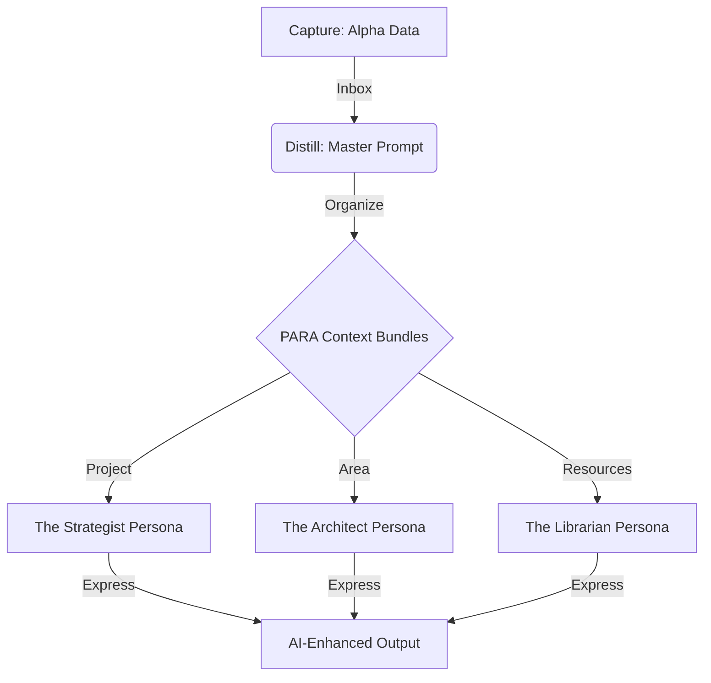

# The AI-CODE Workflow

We have upgraded the PKM from a static repository into a **Personal AI Infrastructure (PAI)**. This shift moves us from manual filing to dynamic data pipelines, using Tiago Forte's AI-centric CODE and PARA frameworks.

## 1. The Architecture: PARA as Context Bundles

In this system, PARA folders are no longer just storage; they are **Context Bundles**. When working on a task, PAI loads only the relevant folder to prevent "context poisoning."

## 2. The Board of Advisors

We've established specialized AI personas (Agents) tied to specific PARA categories:

| Persona            | PARA Context            | Specialty                                                       |
| ------------------ | ----------------------- | --------------------------------------------------------------- |
| **The Strategist** | `the-strategic-bridge/` | Strategic frameworks, long-form writing, and decision science.  |
| **The Architect**  | `pattern-languages/`    | Systems thinking, modular design, and structural PKM integrity. |
| **The Librarian**  | `dispatches/` (Inbox)   | Distillation, data cleaning, and Master Prompt generation.      |

## 3. The Distillation Engine

The "Distill" phase is now automated. Using the `distill_master_prompt.md` template, PAI takes raw "Alpha" data—transcripts, niche captures, and offline conversations—and transforms them into operational manuals.

### The Protocol:
1. **Capture:** Drop raw `.md` files into `content/dispatches/`.
2. **Distill:** Ask PAI to "Distill this dispatch into a Master Prompt."
3. **Organize:** Move the distilled manual into the relevant PARA Project or Area.
4. **Express:** Invoke the corresponding Agent from the **Board of Advisors** to iterate on the output.

## 4. Why This Works
- **Clean Data:** We focus on "Alpha" data—info the AI *doesn't* already have in its training set.
- **Precision:** Context Bundles keep the AI's focus sharp.
- **Velocity:** Manual organization is replaced by agentic orchestration.

---
*Generated by PAI in collaboration with Garth.*
